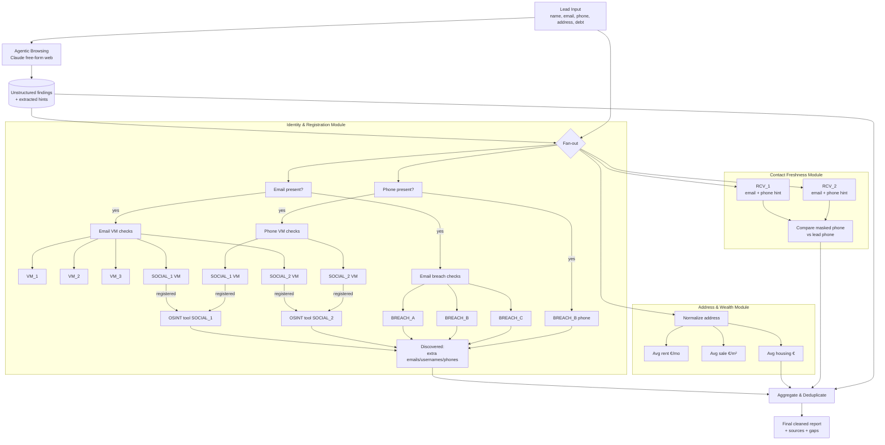

# Enrichment Pipeline — Prototype

Provider names in this file are masked. See `aliases.private.md` (gitignored) for the real mapping.

## Enrichment JSON shape

```json
{
  "case_id": "C001",
  "lead_input": {
    "full_name": "…",
    "email": "…",
    "phone": "+34…",
    "address": { "raw": "…", "country": "ES", "city": "…", "postal_code": "…" },
    "debt": { "amount_eur": 21077, "origin": "personal_loan", "age_months": 31 }
  },

  "unstructured_browsing": {
    "source": "claude_web_browsing",
    "raw_findings": "free-text dump",
    "extracted_hints": {
      "possible_usernames": [],
      "possible_emails": [],
      "possible_phones": [],
      "possible_social_links": [],
      "possible_employers": []
    },
    "citations": [{ "url": "…", "claim": "…", "confidence": 0.0 }]
  },

  "identity_enrichment": {
    "email_checks": {
      "vm_registrations": [
        { "provider": "VM_1",  "type": "vm",       "registered": true,  "evidence_url": null },
        { "provider": "VM_2",  "type": "vm",       "registered": false },
        { "provider": "VM_3",  "type": "vm",       "registered": null,  "error": "timeout" },
        { "provider": "RCV_1", "type": "recovery", "registered": true },
        { "provider": "RCV_2", "type": "recovery", "registered": true }
      ],
      "breach_checks": [
        { "provider": "BREACH_A", "found": true,  "sites": ["…"] },
        { "provider": "BREACH_B", "found": true,  "sites": ["…"], "leaked_fields": ["password_hash"] },
        { "provider": "BREACH_C", "found": false }
      ]
    },
    "phone_checks": {
      "vm_registrations": [
        { "provider": "SOCIAL_1", "type": "social_vm", "registered": true },
        { "provider": "SOCIAL_2", "type": "social_vm", "registered": false }
      ],
      "breach_checks": [
        { "provider": "BREACH_B", "found": true, "sites": ["…"] }
      ]
    },
    "social_profiles": [
      {
        "platform": "SOCIAL_1",
        "handle": "guessed_or_found",
        "osint_tool": {
          "followers": 0, "following": 0,
          "emails_leaked": [], "phones_leaked": [],
          "tagged_locations": []
        }
      }
    ],
    "discovered": {
      "possible_emails": [],
      "possible_usernames": [],
      "possible_phones": []
    }
  },

  "address_module": {
    "normalized_address": "…",
    "geo": { "lat": 0, "lon": 0 },
    "cost_of_living": {
      "avg_rent_eur_month": 0,
      "avg_sale_price_eur_m2": 0,
      "avg_housing_price_eur": 0,
      "source": "…"
    }
  },

  "freshness_module": {
    "RCV_1": { "email_valid": true, "phone_hint": "+34 *** *** *12", "phone_hint_matches_lead_phone": true },
    "RCV_2": { "email_valid": true, "phone_hint": "***12",           "phone_hint_matches_lead_phone": true },
    "verdict": { "email_likely_current": true, "phone_likely_current": true }
  },

  "signals_summary": {
    "wealth_signals": [],
    "registered_sites_count": 0,
    "breaches_count": 0,
    "contactability_score": 0.0,
    "gaps": []
  },

  "run_meta": {
    "started_at": "…", "finished_at": "…",
    "agents": [{ "name": "browser", "status": "ok", "tokens": 0 }]
  }
}
```

## Flow


